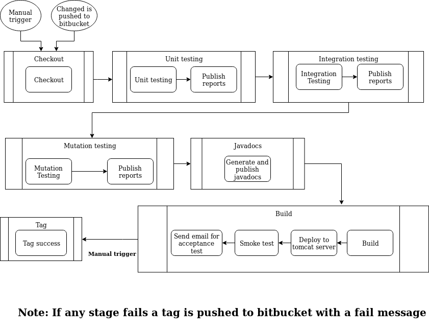

# Component 1

## Sketch of pipeline



## Description

The pipeline can be trigered by 2 events:

 * Manually from jenkins
 * A change in the bitbucket repository
     * Every 5 minutes there's a check for changes in the repository. If there's a change, the pipeline will be triggered.

This pipeline does the following:

1. Checkout
      1. Checkouts from git repository and archives the folder of component 1 for the later stages
2. Unit testing
      1. Runs the unit tests of the application
      2. Publishes unit test report and unit test coverage report
3. Integration testing
      1. Runs the integration tests of the application
      2. Publishes integration test report and integration test coverage report
4. Mutation testing
      1. Runs mutation tests
      2. Publishes mutation test report
5. Javadocs
      1. Generates and publishes Javadocs
6. Build
      1. Builds the application war file
      2. Deploys the application to a pre-configured tomcat server
      3. Performs a smoke test using curl to see if the application is running
      4. Sends email to a pre-configured email address to warn the user to perform a UI acceptance test
7. Tag
      1. If the user accepts the build, it tags success message on the repository with the following name: ca2-comp1-#<BUILD_NUMBER>-passed

Technical description of each step:

1. Checkout
      1. A checkout is made using [jenkins git plugin](https://plugins.jenkins.io/git)
      2. After the checkout is made the folder odsoft/exercise2/component1/cms/ and it's directories are archived for further use in the pipeline. A fingerprint is recorded for the files
2. Unit testing
      1. Runs the tasks ```cleanTest test jacocoTestReport```
      2. Publishes test and coverage reports with [HTML publisher plugin](https://plugins.jenkins.io/htmlpublisher)
3. Integration testing
      1. Runs the tasks ```cleanTest integrationTest jacocoIntegrationReport```
      2. Publishes test and coverage reports with [HTML publisher plugin](https://plugins.jenkins.io/htmlpublisher)
4. Mutation testing
      1. Runs the task ```pitest```
      2. Publishes mutation report with [HTML publisher plugin](https://plugins.jenkins.io/htmlpublisher)
5. Javadocs
      1. Runs the task ```javadoc```
      2. Publishes javadocs with [HTML publisher plugin](https://plugins.jenkins.io/htmlpublisher)
6. Build
      1. Builds the application war file by running the task ```war```
      2. Archives war file
      3. Deploys to a pre-configured tomcat server using [Deploy to container plugin](https://plugins.jenkins.io/deploy)
      4. Performs a smoke test using the following command: ```curl --fail tomcat:8080/cms``` . The address of the tomcat server is tomcat because both jenkins and tomcat are running in a docker container with the same docker network. Because of this they can contact each other using the name of the other container
      5. Sends an email to a pre-configured email address using [Email extension plugin](https://plugins.jenkins.io/email-ext)
7. Tag
      1. Pushes a tag to the repository using a shell script with [post build task plugin](https://plugins.jenkins.io/postbuild-task)

If any of the stages fail the pipeline pushes a tag to bitbucket with the following format: ca2-comp1-#<BUILD_NUMBER>-failed