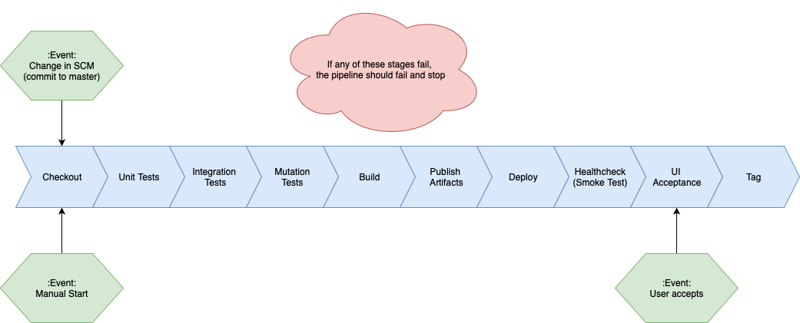

# Class Assignment 2 Component 3

The goal of this class assignment is to design and create a Jenkins Pipeline that performs a set of tasks declared in a Scripted Jenkinsfile, as a sequential build. If any of the tasks fail, the pipeline build should immediately fail.

The tasks to be performed are the following:

- `Repository Checkout`: Checkout the GIT repository
- `Unit Tests`: Execute the Unit Tests, generate a Unit Tests Report, generate a Unit Tests Coverage Report and publish both reports on Jenkins
- `Integration Tests`: Execute the Integration Tests, generate an Integration Tests Report, generate an Integration Tests Coverage Report and publish both reports on Jenkins
- `Mutation Tests`: Execute the Mutation Tests, generate a Mutation Coverage Report and publish it on Jenkins
- `War file`: Build the .war file and publish it on Jenkins
- `Javadoc`: Build the Javadoc and publish it on Jenkins
- `Deploy and Smoke test`: Deploy the application (.warfile) to a pre-configured Tomcat Serverinstance. Perform an automatic smoke test. This smoke test can be as simple as using curl to check if the base url of the application is responsive after deployment in the Tomcat Server, ensuring that the application is properly deployed to the Staging Environment
- `UI Acceptance Manual Tests`: A user should be notified by email of the successful execution of all the previous tests and be asked to perform a manual test. In order to cancel the progression or proceed, a UI Acceptance Manual Test must take place. The pipeline should wait for a user manual confirmation on Jenkins
- `Continuous Integration Feedback`: Push a tag to the repository with the Jenkins build number and status (e.g. Build#32-Passed or Build#32-Failed)


## Pipeline Design

To conceive the creation of the pipeline, the following activity diagram proposed the execution flow of the pipeline:




## Pipeline Implementation

In order to implement the pipeline, a Scripted Jenkinsfile was created which exports the logic for the pipeline execution. This file is organized in two sections:

- Functions used by the pipeline declaration
- Pipeline node declaration

In order to execute the pipeline, Jenkins must be prepared to use the following plugins:

|Plugin|Description|
|------|-----------|
|[Publish HTML](https://wiki.jenkins.io/display/JENKINS/HTML+Publisher+Plugin)|Publishes in Jenkins an item that displays an HTML document|
|[Deploy Plugin](https://wiki.jenkins.io/display/JENKINS/Deploy+Plugin)|Allows the deployment of a WAR/EAR file to a running remote application server. Used to deploy WAR file on Tomcat server|
|[Email-ext plugin](https://wiki.jenkins.io/display/JENKINS/Email-ext+plugin)|Allows the send of an email|

### Pipeline Declared Functions

The functions declared in the first section provide functionalities such as execution of commands in the system defined interface or information retrieval. The following table describes the declared functions:

|Function|Description|
|--------|-----------|
|`run_command(command)`|Runs a command on the system defined interface (if in Unix system calls sh step, else bat step for Windows)|
|`run_gradlew(gradlew_commands)`|Runs gradle wrapper located in the folder of the current running execution environment|
|`get_bitbucket_username()`|Allows the retrieval of the bitbucket username defined in bitbucketCredentials authentication keys|
|`get_bitbucket_password()`|Allows the retrieval of the bitbucket username defined in bitbucketCredentials authentication keys|
|`resolve_path(path)`|Resolves a given path by replacing either / with \\ in Windows, or replacing \\ with / in Unix systems|
|`get_http_request(uri)`|Performs a GET HTTP request. In Unix system uses curl, Invoke-RestMethod on Windows using powershell|

### Pipeline node

The pipeline node starts by declaring a set of variables used in the pipeline stages. This is done in order to remove duplicated code, as each pipeline stage requires the value given by these variables more than one time. The following table describes the declared variables:

|Variable|Description|
|--------|-----------|
|`passed_build_tag_name`|Marks the name of the tag that will be pushed to repository if the pipeline build succeeds|
|`failed_build_tag_name`|Marks the name of the tag that will be pushed to repository if the pipeline build fails|
|`tomcat_server_url`|Indicates the URL in which the Tomcat Server is running|
|`bitbucket_username`|Indicates the username to be used in bitbucket repositories|
|`bitbucket_password`|Indicates the password to be used in bitbucket repositories|
|`cms_path`|Indicates the relative path starting from the pipeline workspace to cms folder|

Next a set of stages are declared in which each of these perfom a set of actions relative to the stage. The following tables describes the declared stages:

|Stage|Description|
|-----|-----------|
|`Checkout`|Performs a Git checkout of the repository to be used in the pipeline and configures Git local account name and email. This last step is required as the pipeline needs to create and push tags to the repository. If this stage fails, the pipeline fails and no tag is pushed to the repository|
|`Test`|Performs unit, integration, mutation tests and their reports generation of the cms project. These actions are performed in parallel and gradle wrapper is invoked to execute these. Although the pipeline is designed to generate tests reports in artifacts build stage, the generation of these is perfomed in this stage as the tasks that allow the test of the cms project are pre-configured to generate the reports. If this stage fails, the pipeline fails and a tag is pushed to repository informing that the pipeline has failed in pre build tests stage|
|`Build`|Builds the WAR and Javadoc artifacts of the cms project. These build is perfomed in parallel as war and javadoc do not depend on each other. Gradle wrapper is invoked to perfom the build of these artifacts. If this stage fails, the pipeline fails and a tag is pushed to repository informing that the pipeline has failed in artifacts build stage|
|`Artifacts Publish`|Publishes built artifacts in Jenkins. Test Reports and Javadoc publish is performed using `publishHTML` step and WAR using `archiveArtifacts` step. Archive Artifacts step could also be used to publish the reports and javadoc, but it was preferred to use Publish HTML plugin as the output in the Jenkins page is prettier and more usable. The publish of these artifacts is performed in parallel as there is no requirement in the order of the publish. If this stage fails, the pipeline fails and a tag is pushed to repository informing that the pipeline has failed in artifacts publish stage|
|`Deploy`|Deploys the built WAR artifact in a Tomcat server|
|`Healtcheck`|Checks if the web server is up with the use of a curl command|
|`UI Acceptance`|The user gets sent an email warning about pipeline status. After manually testing the web server, he confirms that the pipeline should continue|


## Pipeline Performance

The pipeline was tested and run using `docker-compose` that launches a container for the most recent Jenkins version (`jenkins/jenkins:lts`) and a container for Tomcat Server 9.0.27 (`tomcat:9.0.27-jdk8-openjdk`).
The machine used has the following specs:

```
Hardware Overview:
  Model Name:	MacBook Pro
  Model Identifier:	MacBookPro15,2
  Processor Name:	Intel Core i5
  Processor Speed:	2,3 GHz
  Number of Processors:	1
  Total Number of Cores:	4
  L2 Cache (per Core):	256 KB
  L3 Cache:	6 MB
  Hyper-Threading Technology:	Enabled
  Memory:	16 GB
  Boot ROM Version:	220.260.170.0.0 (iBridge: 16.16.5125.0.0,0)
  Serial Number (system):	C02X84C9JHD2
  Hardware UUID:	86D36215-8353-5850-B751-DCBD9CB03217
```

On a clean workspace, the pipeline shows the following performance results on each stage:

|Stage|Time|Parallel Stage|Explanation|
|-----|----|--------------|-----------|
|Checkout|`3 seconds`|No|Takes about 1 to 5 seconds to complete this stage as the most time-cost operation is the Git repository checkout. Could take more time to complete if the repository space scales higher and the network latency is higher|
|Test|`3 minutes and 21 seconds`|No|Integration tests take about 2 minutes and 15 seconds to run. This is due to the requirement of launching a browser instance to perfom the tests.|
|Build|`2 minutes and 44 seconds`|No|WAR build takes about 1 minute and 40 seconds to complete as permutations are being computed for four different browsers (Chrome, Firefox, Opera and Safari). Removing supported browsers speeds up build|
|Publish|`2 seconds`|No|Can be slower if files space to publish on Jenkins is higher|
|Deploy|`3 seconds`|No|Deployment and tag push takes about 2 seconds. Can be slower if network latency is higher|
|Healthcheck|`5 seconds`|No||

Sequential builds show the following performance results:

|Stage|Time|Parallel Stage|Explanation|
|-----|----|--------------|-----------|
|Checkout|`2 second`|No|If no changes were detected in the repository, checkout is faster as it uses local repository existent on the workspace|
|Test|`2 minutes and 23 seconds`|No|If no changes were dected in the source or test code, unit, mutation and integration do not require to be executed again|
|Build|`16 seconds`|No|If no changes in the source code are dected, WAR is not required to be built again|
|Publish|`190 milliseconds`|No|Can be slower if files space to publish on Jenkins is higher|
|Deploy|`23 miliseconds`|No|Can be slower if files space to publish on Jenkins is higher|
|Healthcheck|`23 miliseconds`|No||