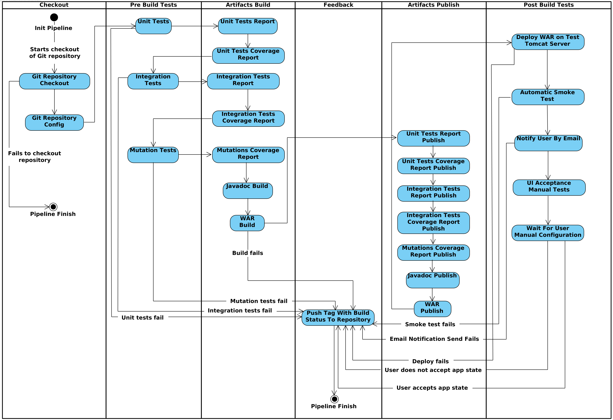

# Report

## Component 1

As you can see by the image the pipeline has the following stages and each stage and took the following duration for a trigger:

* cms-ca2-checkout: 20 seconds
* cms-ca2-unit_test: 57 seconds
* cms-ca2-integration_test: 16 seconds
* cms-ca2-mutation_test: 1 minute 55 seconds
* cms-ca2-javadocs: 14 seconds
* cms-ca2-build: 16 seconds
* cms-ca2-tag: 5.7 seconds

If the testing stages were parallelized it would save at least 1 minute and 13 seconds, since integration_test would not have to wait for unit_test and mutation_test would not have to wait for integration_test

## Component 3

- Checkout: 3 seconds
- Pre Build Tests: 3 minutes 21 seconds
- Artifacts Build: 2 minutes and 44 seconds
- Artifacts Publish: 2 seconds
- Deploy: 3 seconds
- Healthcheck: 5 seconds

Comparing with component 4 values it is possible to identify that sequential pipeline is slower. Pre build tests are affectly slower as they take more 41 seconds as well as the artifacts build take more 1 minute and 3 seconds.

## Component 4

As you can see by the image the pipeline has the following stages and each stage and took the following duration for a trigger:

- Checkout: 3 seconds
- Pre Build Tests: 2 minutes and 43 seconds
- Artifacts Build: 1 minute and 41 seconds
- Artifacts Publish: 925 milliseconds
- Deploy and Post Build Tests: 7 seconds

Comparing with the times presented in component 1, it is possible to identify that parelelism does reduce the time spent in the pipeline build. Pre build tests take 2 minutes and 43 seconds to complete in component 4, while in component 1 it takes 3 minutes and 8 seconds.