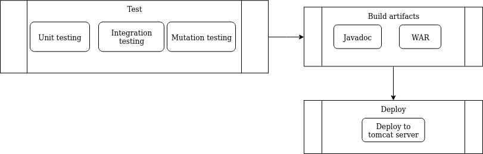
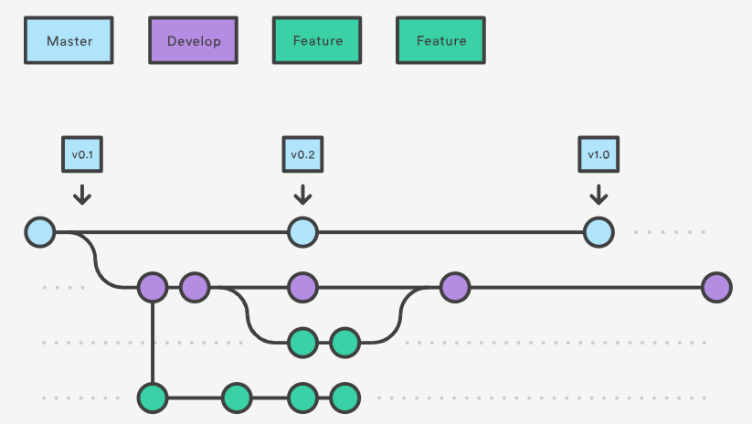

# Report

## Base Pipeline and Persistence

### Base Pipeline



The pipeline designed for this project contains three stages:

* Test: Runs all project tests in parallel
  * In the post phase the reports generated of the tests are published
* Build Artifacts: Builds javadocs and WAR file in parallel
  * In the post phase javadocs are published and the WAR file is artifacted
* Deploy: Deploys to a tomcat server

### Branching Model

The branching model used in this project is based on git flow:



There's a master branch that always contains a stable version of the project. Tags can be made on the master branch for releases. There's also the development branch which is used to create new branches to develop features in the product.

The features branch should always be merged into the development branch for the purpose of testing all the merged feature branches.

When the product as a whole is stable on the development branch, it should be merged into master.

Advantages:

* Master always has a stable version of the program which can be deployed (tagged) at any moment

* Development branch has version that can be tested to be merged into master

## Continuous Deployment

For this task, it was decided that the deploys will only happen from the master branch. The reasons for the decision were:
  * Master branch always has a ready to deploy version
    * Deploys can happen at anytime, since this branch is always stable
  * Development branch is the branch to be tested for merging into master
    * Developers can test in the development branch all the features that will be merged into the master branch beforehand
  
Developers might have the need to merge User Stories into the master branch that are not planned for immediate deployment. E.g. a black friday promotion that should only be deployed on the same day. Because of this reason, in this project the deployments are only activated when tagging the master branch.

To simulate the production server a docker container of tomcat was created via docker-compose:

```
version: '2'
services:
  tomcat:
    image: 'tomcat:9.0.27-jdk8-openjdk'
    ports:
      - '8080:8080'
    networks:
      - bridge
    volumes:
      - 'tomcat_conf:/usr/local/tomcat'
volumes:
  tomcat_conf:
      driver: local
networks:
  bridge:
```

The port is 8080 of the container is exposed to the host machine in the same port. A volume was created for the directory '/usr/local/tomcat' so the configurations for jenkins are persisted.
